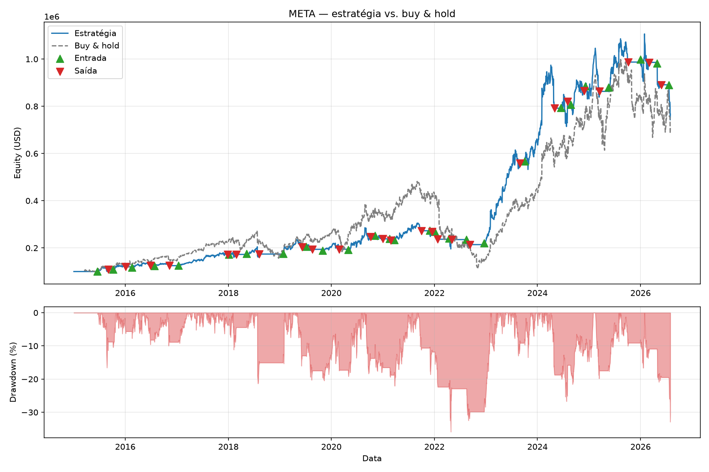
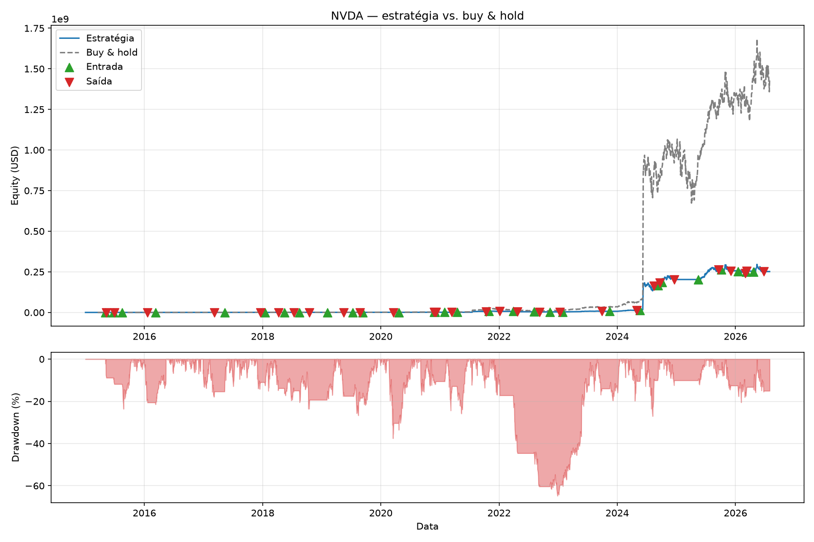

# quantlab

Plataforma de backtesting de estratégias sistemáticas sobre ações americanas.

O objetivo do projeto **não** é encontrar uma estratégia lucrativa. É construir um
instrumento de medição confiável — um backtester correto por construção quanto a
lookahead bias. Uma estratégia que perde dinheiro num engine correto é um resultado
válido e é reportada como tal. É exatamente o que a seção [Resultados](#resultados)
abaixo faz.

---

## Estado atual — Fase 1 concluída (MVP)

Ingestão real → MongoDB → backtest SMA cross → métricas → benchmark → relatório →
gráfico, ponta a ponta, com um resultado honesto rodado contra dado de mercado real.

| Fase | Escopo | Estado |
|---|---|---|
| 1 | MVP: ingestão → Mongo → backtest SMA → métricas → gráfico | ✅ concluída |
| 2+ | Custos realistas, portfólio multi-ativo, walk-forward, analytics de risco, API, infra, RAG | — |

O roadmap completo está em [`specs/README.md`](specs/README.md).

## Stack

| Camada | Escolha | Por quê |
|---|---|---|
| Linguagem | Python 3.12+ | — |
| Pacotes | `uv` | Resolução e sync rápidos, lockfile versionado |
| Dados | `pandas`, `numpy` | Séries e vetorização |
| Banco | MongoDB 7 | [ADR-0001](specs/adr/0001-mongodb-vs-relacional.md) |
| Provedor de dados | `yfinance` | Gratuito, cobre OHLCV diário e eventos corporativos |
| CLI | `typer` | — |
| Configuração | `pydantic-settings` | Validação na fronteira, tudo via env |
| Logging | `structlog` | Saída estruturada; o projeto não usa `print()` |
| Gráficos | `matplotlib` | — |
| Qualidade | `ruff`, `mypy --strict`, `pytest`, `pre-commit` | RNF-05 |

## Arquitetura

```
                 ┌──────────────┐
 yfinance ──────▶│  ingestion/  │──────┐
                 └──────────────┘      │
                                        ▼
                              ┌───────────────────────┐
                              │        storage/        │
                              │  bars (bruto)           │◀── MongoDB
                              │  corporate_actions       │
                              │  quarantined_bars         │
                              │  ingestion_runs             │
                              │  backtest_runs                │
                              └──────────┬─────────────────────┘
                                         │ PriceSeries (ajustada)
                                         ▼
   strategies/ ──Signal──▶  ┌──────────────────┐
        ▲                   │      engine/       │
        │  MarketView       │  loop de barras     │
        └───────────────────│  Broker/Portfolio    │
                             └────────┬─────────────┘
                                      │ BacktestResult
                                      ▼
                             ┌──────────────────┐
                             │    analytics/      │──▶ Relatório (texto/JSON) + PNG
                             └──────────────────┘
```

Dependências apontam para dentro: `engine/` não conhece MongoDB nem yfinance, recebe
uma `PriceSeries` já materializada. `strategies/` não conhece o engine, só o contrato
(`Strategy` Protocol). É o que permite testar engine e analytics inteiramente com
séries de papel construídas à mão (RNF-03) — sem banco, sem rede.

## Invariantes

Três decisões arquiteturais fecham o comportamento do sistema e são impostas por
construção, não por convenção — cada uma tem teste de aceitação dedicado:

- **[ADR-0002](specs/adr/0002-execucao-no-open-seguinte.md) — execução no `open` do
  pregão seguinte.** Um sinal calculado com informação até o fechamento de D só pode
  ser executado a partir da abertura do próximo pregão. A `MarketView` que a estratégia
  recebe só sabe devolver barras de índice `≤ i` — não há caminho normal para ler o
  futuro. Provado por `test_mutating_future_bars_does_not_change_trades`: mutar
  arbitrariamente as barras posteriores à última decisão e reexecutar produz
  exatamente o mesmo conjunto de trades.
- **[ADR-0003](specs/adr/0003-ajuste-em-tempo-de-leitura.md) — preço bruto persistido,
  ajuste em tempo de leitura.** O ajuste por proventos não é propriedade do passado —
  é função do presente: cada novo dividendo reescreve a série ajustada inteira,
  retroativamente. Persiste-se OHLCV bruto; nunca se grava o ajustado por cima.
- **[ADR-0004](specs/adr/0004-ajuste-sobre-historico-completo.md) — ajuste
  materializado sobre o histórico completo, depois fatiado.** Duas leituras de janelas
  distintas sobre o mesmo estado do banco concordam valor a valor nas barras que
  compartilham — independência de janela, garantida por construção porque o cálculo do
  fator de ajuste nunca vê a janela pedida.
- **[ADR-0001](specs/adr/0001-mongodb-vs-relacional.md) — MongoDB como banco
  primário**, índice composto `(ticker, date)`. A camada de repositório isola o resto
  do sistema do driver — `engine/` não importa `pymongo`.

## Como rodar

Pré-requisitos: [uv](https://docs.astral.sh/uv/), Docker e `make`.

```bash
cp .env.example .env
make install
make up
```

`make up` sobe o MongoDB e só retorna quando o healthcheck passa.

**Ingerir dados** (RF-CLI-01) — sem `--tickers`, usa o universo default de
`config/universe.yml`:

```bash
python -m quantlab ingest --from 2015-01-01 --to 2024-12-31
```

**Rodar um backtest** (RF-CLI-02) — janela default 2015-01-01 até a última barra
disponível:

```bash
python -m quantlab backtest --strategy sma_cross --ticker AAPL --fast 20 --slow 50
```

Imprime o relatório no terminal e salva `results/AAPL_sma_cross_20_50.png` (gráfico) e
`.json` (relatório), além de persistir o run em `backtest_runs`. Ticker sem dado
ingerido falha com mensagem acionável e código de saída ≠ 0, em vez de um erro genérico
do driver.

### Alvos do Makefile

| Alvo | O que faz |
|---|---|
| `make install` | Instala dependências de runtime e de desenvolvimento |
| `make up` / `down` / `logs` | Ciclo de vida do MongoDB local |
| `make test` | Suíte default com cobertura (integração desmarcada) |
| `make test-unit` / `test-integration` | Recortes por marcador |
| `make lint` / `format` | `ruff check` / `ruff format` |
| `make typecheck` | `mypy --strict` |
| `make audit` | `pip-audit` nas dependências instaladas |
| `make check` | **Portão local:** lint + typecheck + test — o mesmo que o CI roda |
| `make clean` | Remove caches e artefatos |

## Estrutura

```
quantlab/
├── config/
│   └── universe.yml          # 20 tickers por setor GICS, lista fixa e versionada
├── specs/                    # fonte da verdade do projeto — leia antes de codar
│   ├── README.md             # fluxo, gates, índice de ADRs, roadmap
│   ├── 00-plataforma/        # requisitos e design da Fase 1
│   ├── adr/                  # decisões arquiteturais, numeradas e imutáveis
│   └── _templates/           # esqueletos de requirements, design, tasks e ADR
├── src/quantlab/
│   ├── cli.py                # app Typer: `ingest`, `backtest`, `version`
│   ├── config.py             # Settings via env (prefixo QUANTLAB_)
│   ├── logging.py            # structlog: JSON fora de dev, legível em dev
│   ├── exceptions.py         # QuantlabError e subclasses
│   ├── ingestion/            # provedor (yfinance), normalização, validação, orquestração
│   ├── storage/               # repositório Mongo, ajuste em tempo de leitura, hashing
│   ├── engine/                 # MarketView, Strategy, Portfolio, Broker, laço de barras
│   ├── strategies/              # SMA cross
│   └── analytics/                # métricas, benchmark, relatório, gráfico
├── tests/
│   ├── conftest.py           # fixtures de infraestrutura
│   ├── support.py             # fakes (FakeProvider, FakeRepository, ...)
│   ├── unit/                   # rodam sempre, offline — fixtures de papel para engine/analytics
│   └── integration/             # exigem `make up`
├── results/                  # artefatos do backtest de F4 — comprometidos de propósito
├── docker-compose.yml        # MongoDB 7
└── CLAUDE.md                 # regras de trabalho no repositório
```

## Resultados

**SMA cross, parâmetros fixos `fast=20, slow=50`, em todos os 20 tickers do universo
default, janela 2015-01-01 até a última barra disponível (2026-07-31 — o pregão de
2026-08-03 foi quarentenado em todos os tickers por preço não finito retornado pelo
provedor; ver [Limitações](#limitações-conhecidas)).**

Nenhuma varredura de parâmetros, nenhuma seleção de tickers favoráveis, nenhum recorte
de janela. `fast`/`slow` foram escolhidos uma vez, antes de rodar, e usados em todos os
20 tickers sem ajuste. Otimizar parâmetros contra a mesma amostra e reportar o melhor é
precisamente o viés 6 da seção de vieses abaixo — o objetivo aqui é medir, não vencer.
Custos: USD 1 fixo + 1 bps por trade (default). Capital inicial: USD 100.000.

| Ticker | CAGR estratégia | CAGR buy & hold | Sharpe estratégia | Sharpe buy & hold | Max DD estratégia | Max DD buy & hold | Trades | Taxa de acerto | Vencedor (CAGR) |
|---|---:|---:|---:|---:|---:|---:|---:|---:|---|
| AAPL | 27.08% | 39.29% | 0.433 | 0.539 | 28.01% | 38.52% | 33 | 46.9% | buy & hold |
| AMT | 1.57% | 8.05% | 0.177 | 0.430 | 48.09% | 45.34% | 31 | 38.7% | buy & hold |
| AMZN | 11.66% | 64.63% | 0.571 | 0.346 | 56.65% | 44.20% | 28 | 50.0% | buy & hold |
| BRK-B | 3.21% | 11.65% | 0.316 | 0.673 | 27.12% | 29.55% | 32 | 48.4% | buy & hold |
| CAT | 13.35% | 25.52% | 0.669 | 0.893 | 56.16% | 43.36% | 29 | 44.8% | buy & hold |
| CVX | 0.10% | 10.09% | 0.096 | 0.478 | 49.45% | 55.76% | 34 | 36.4% | buy & hold |
| GOOGL | 14.80% | 62.73% | 0.748 | 0.345 | 45.25% | 31.66% | 28 | 64.3% | buy & hold |
| HD | 4.57% | 12.28% | 0.351 | 0.599 | 27.55% | 37.98% | 30 | 55.2% | buy & hold |
| JNJ | 3.05% | 11.49% | 0.296 | 0.687 | 31.15% | 27.37% | 36 | 42.9% | buy & hold |
| JPM | 12.33% | 19.70% | 0.744 | 0.802 | 24.15% | 43.62% | 27 | 61.5% | buy & hold |
| KO | 2.47% | 10.36% | 0.246 | 0.640 | 23.78% | 36.98% | 35 | 47.1% | buy & hold |
| LIN | 6.37% | 14.55% | 0.466 | 0.718 | 34.43% | 32.58% | 29 | 53.6% | buy & hold |
| META | 19.25% | 18.57% | 0.803 | 0.641 | 35.87% | 76.73% | 27 | 53.8% | **estratégia** |
| MSFT | 9.78% | 25.13% | 0.563 | 0.953 | 39.81% | 37.15% | 30 | 50.0% | buy & hold |
| NEE | 18.95% | 28.59% | 0.366 | 0.459 | 32.96% | 44.97% | 30 | 51.7% | buy & hold |
| NVDA | 96.70% | 132.40% | 0.519 | 0.591 | 64.79% | 66.34% | 30 | 60.0% | buy & hold |
| PG | 2.37% | 7.93% | 0.250 | 0.502 | 30.76% | 23.77% | 34 | 51.5% | buy & hold |
| UNH | 2.02% | 13.36% | 0.203 | 0.577 | 62.36% | 61.39% | 31 | 46.7% | buy & hold |
| UNP | 1.40% | 10.75% | 0.167 | 0.530 | 30.27% | 40.50% | 32 | 51.6% | buy & hold |
| XOM | 2.76% | 9.85% | 0.238 | 0.479 | 38.82% | 61.32% | 33 | 34.4% | buy & hold |

**A estratégia perdeu para o buy-and-hold em CAGR em 19 dos 20 tickers, e em Sharpe em
17 dos 20** (vence em Sharpe também em AMZN e GOOGL, além de META, que já vencia em
CAGR). Rf=0, sem correção para múltiplas hipóteses.

**Por que os dois números não coincidem (RF-CON-03).** A diferença não é um achado —
é a assinatura da própria classe de estratégia. SMA cross sai da posição em toda
reversão de tendência, e sair do mercado corta **os dois lados ao mesmo tempo**: o
retorno que teria vindo do trecho evitado, e a volatilidade/drawdown que vinha junto.
CAGR só enxerga o primeiro corte — por isso a estratégia perde nele quase sempre (19/20:
o custo de oportunidade de ficar fora do mercado supera, quase sempre, o que se evita em
queda). Sharpe divide retorno por risco, então enxerga os dois cortes ao mesmo tempo — e
em AMZN e GOOGL o corte de risco foi grande o bastante para compensar o corte de
retorno, mesmo com CAGR pior. Não é a estratégia "acertando o mercado" nesses dois
tickers: é o mesmo mecanismo — sair da posição — sendo medido por uma métrica que
credita reduzir variância, não só maximizar retorno. Tratar essas duas contagens
diferentes como sinais contraditórios, ou como evidência de que Sharpe "descobriu" algo
que CAGR não viu, seria ler ruído estrutural do próprio desenho da estratégia como
informação nova.

### Fase 2a — multi-ativo, benchmark 1/N (2026-08-14)

**SMA cross 20/50 sobre o portfólio 1/N dos mesmos 20 tickers,
2015-01-02 a 2026-08-05 (2.914 barras de união), contra benchmark 1/N
buy-and-hold — custos (USD 1 + 1 bps), slippage (1 bps) e cap de
participação (10% do ADV) idênticos nos dois lados (mesmo N, mesmas regras
de entrada, S6).** Relatório completo em
[`results/fase_2a_run_20_ativos.json`](results/fase_2a_run_20_ativos.json).

| | Estratégia (SMA 20/50, 1/N) | Benchmark (1/N B&H) |
|---|---:|---:|
| Retorno acumulado | +217,93% | +2.509,09% |
| CAGR | 10,50% | 32,50% |
| Sharpe | 1,04 | 1,15 |
| Max drawdown | 14,74% | 43,00% |
| Trades | 618 | 20 |
| Turnover anualizado | 2,69 | 0,01 |
| Exposição média | 64,22% | 99,58% |

**Mesma assinatura da Fase 1, agora multi-ativo:** a estratégia perde em
retorno (618 trades × custos + tempo fora do mercado num mercado de alta
prolongada) e ganha em drawdown (14,74% vs 43,00% — sair da posição corta
risco junto com retorno; é o mesmo mecanismo do RF-CON-03 acima, agora
medido uma única vez no portfólio em vez de por ticker). Nota de
honestidade: 13 dos 20 tickers têm a série truncada pela ingestão (terminam
2026-07-31; AAPL vai a 2026-08-05) e são reportados como "deslistados" —
semântica de série terminada (POR-02.3), não deslistagem real de mercado.

Nota de dados: durante este run foi encontrado e corrigido um bug real da
ingestão da Fase 1 (dupla contagem de splits no raw — ver
[docs/STATE.md](docs/STATE.md) e o CHANGELOG). O run da Fase 2a usou a base
corrigida; os 20 relatórios por ticker da Fase 1, não.

### Interpretação

Isto é o resultado esperado, não uma falha do engine. Mega caps americanas entre
2015 e 2026 atravessaram um dos mercados de alta mais longos e persistentes da
história recente — inclusive a recuperação em V pós-2020. Nesse regime, qualquer
estratégia que gaste tempo fora do mercado (como o cruzamento de médias móveis, que
sai da posição em toda reversão de tendência) paga o custo de oportunidade de não
estar posicionada durante os trechos de alta mais fortes, e paga de novo em custos de
transação a cada entrada e saída — 27 a 36 trades por ticker aqui, contra 1 do
buy-and-hold. A literatura de seguimento de tendência é consistente nisso: SMA cross
tende a perder para buy-and-hold em mercados de alta prolongada e só se paga em
mercados laterais ou de queda, onde evitar o drawdown grande compensa o retorno
perdido nas altas. META é a única exceção aqui — não porque a estratégia "funcionou
melhor" nela, mas porque META teve uma queda de 76.7% (2021-2022, era do metaverso)
que o buy-and-hold sofreu inteira e a SMA cross evitou parcialmente saindo da posição.

O número não foi maquiado, nenhum ticker foi excluído, e o parâmetro não foi escolhido
depois de ver o resultado. Um engine que reportasse a estratégia vencendo a maioria
das mega caps americanas dos últimos onze anos seria motivo de desconfiança do próprio
engine, não celebração.

### Exemplos de gráfico

Equity da estratégia vs. benchmark (painel superior, com marcações de entrada/saída) e
drawdown da estratégia (painel inferior):

| META (a exceção) | NVDA (a maior base, mesmo perdendo em CAGR relativo) |
|---|---|
|  |  |

Os 20 gráficos e relatórios completos (JSON, com todas as métricas e a seção de
vieses) estão em [`results/`](results/).

## Limitações conhecidas

Declaradas aqui porque um backtester que esconde suas premissas é pior que nenhum. Os
seis itens fixos abaixo aparecem, literalmente, em todo relatório que o sistema emite
(`BIAS_DISCLOSURE` em `analytics/report.py`) — não são texto de README desalinhado do
código.

1. **Survivorship bias.** O universo em `config/universe.yml` é uma lista fixa de
   empresas que existem e são líquidas hoje. Empresas que faliram ou foram deslistadas
   não aparecem. Isso infla o retorno de qualquer estratégia testada — e do benchmark.
2. **Sem slippage.** Execução integral ao `open`, sem desvio entre preço observado e
   preço pago.
3. **Custos simplificados.** Modelo fixo + bps; sem spread, sem borrow, sem imposto.
4. **Sem impacto de mercado.** Ordens não movem preço, qualquer tamanho executa.
5. **Granularidade de posição fictícia.** Quantidades inteiras calculadas sobre preços
   **ajustados**, que não são os preços históricos reais (AAPL pré-split 4:1 aparece a
   ~1/4 do preço da época). A restrição de ação inteira, portanto, não corresponde à
   restrição que existia historicamente.
6. **Sem correção para múltiplas hipóteses.** Parâmetros testados repetidamente contra
   a mesma amostra inflacionam métricas — razão pela qual este README usa um único par
   `(fast, slow)` fixo em todos os tickers, escolhido antes de rodar.

**O que a Fase 1 deliberadamente não faz** (não é bug, é escopo):

- **Um único ativo por backtest.** `Portfolio` já modela N posições (decisão D4), mas
  a Fase 1 exercita N=1. Sem portfólio multi-ativo, sem rebalanceamento.
- **Sem position sizing.** Entrada é sempre *all-in*: todo o caixa disponível
  (decisão D1). Sem fracionamento de risco por trade.
- **Long-only, sem alavancagem, sem venda a descoberto.**
- **Uma estratégia só** (SMA cross). O contrato (`Strategy` Protocol) já suporta
  outras sem mudança no engine (ENG-05.1), mas nenhuma outra foi escrita.
- **Sem walk-forward nem otimização de parâmetros** — de propósito, dado o viés 6
  acima. Fase 2 escopa isso com a correção estatística apropriada, não como adição
  ingênua de uma varredura de grade.
- **Um único provedor de dados gratuito (yfinance)**, sem fallback para dado
  pago/institucional caso o gratuito falhe ou tenha qualidade pior — mitigado por
  `ResilientProvider` (retry) e pela validação de qualidade (ING-05), mas não
  eliminado. O bug de preço `NaN` corrigido nesta mesma fase (ver
  [HANDOFF.md](HANDOFF.md)) é evidência direta desse risco: dado real de provedor
  gratuito tem qualidade inferior a dado institucional, e a defesa é validação
  explícita, não confiança na fonte.
- **Calendário de pregão não modelado.** Gaps de calendário são tratados via a barra
  seguinte disponível (ADR-0002), sem lista de feriados dedicada.

## Specs e decisões

A pasta [`specs/`](specs/) é a fonte da verdade — nenhuma linha de implementação é
escrita antes da spec correspondente passar pelo gate de design. O fluxo e os gates
estão em [CONTRIBUTING.md](CONTRIBUTING.md); as convenções de código e os invariantes
que não podem ser violados estão em [CLAUDE.md](CLAUDE.md); o histórico de decisões de
cada sessão de trabalho está em [HANDOFF.md](HANDOFF.md).

## Licença

MIT.
